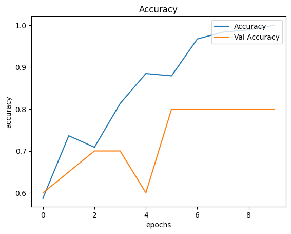
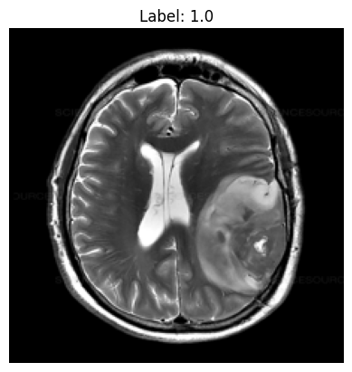

# 🧠 Brain Tumor Classification with CNN

Proyek ini membangun sistem klasifikasi gambar MRI otak menggunakan Convolutional Neural Network (CNN) untuk membedakan antara gambar dengan tumor dan tanpa tumor. Notebook didokumentasikan secara edukatif dan terstruktur, mengikuti template pembelajaran modern.

## 🏗️ Arsitektur Model

Model CNN yang digunakan terdiri dari:
- **Conv2D**: Layer konvolusi untuk ekstraksi fitur.
- **MaxPooling2D**: Reduksi dimensi spasial.
- **Flatten**: Meratakan output konvolusi.
- **Dense**: Layer fully connected untuk klasifikasi.
- **Dropout**: Regularisasi untuk mencegah overfitting.
- **Output**: 1 neuron dengan aktivasi sigmoid (klasifikasi biner).

| Layer            | Output Shape      | Keterangan                |
|------------------|------------------|---------------------------|
| Conv2D (3x3, 32) | (224, 224, 32)   | Ekstraksi fitur awal      |
| MaxPooling2D     | (112, 112, 32)   | Reduksi dimensi           |
| Flatten          | (802816)         | Meratakan tensor          |
| Dense (256)      | (256)            | Fully connected           |
| Dropout (0.5)    | (256)            | Regularisasi              |
| Dense (1, sigmoid)| (1)             | Output klasifikasi        |

## ⚙️ Cara Kerja Sistem

1. **Preprocessing**: Gambar MRI diresize ke 224x224 piksel, dinormalisasi, dan diberi label.
2. **Training**: Model CNN dilatih membedakan gambar tumor dan non-tumor.
3. **Evaluasi**: Model diuji pada data yang belum pernah dilihat.
4. **Prediksi**: Pengguna dapat mengupload gambar MRI baru untuk diprediksi.

## 📊 Hasil & Visualisasi

- **Akurasi Training & Validasi**:  
  Contoh plot akurasi
  
  
- **Contoh Prediksi**:  
  Contoh prediksi gambar
  
    
  _Gambar MRI dengan prediksi: "Tumor detected"_

## 📁 Struktur Folder

```
.
├── brain_tumor_dataset/      # Dataset MRI otak (yes/ dan no/)
│   ├── yes/
│   └── no/
├── Tumor_Otak.ipynb          # Notebook utama klasifikasi tumor otak
├── CNN.ipynb                 # Template referensi CNN (MNIST)
├── requirements.txt          # Daftar dependensi Python
├── .gitignore                # File untuk mengabaikan file tertentu di git
└── README.md                 # Dokumentasi proyek
```

## 🔧 Instalasi

1. Clone repositori ini:

```bash
git clone https://github.com/username/brain-tumor-cnn.git
cd brain-tumor-cnn
```

2. Install dependencies:

```bash
pip install -r requirements.txt
```

3. Download dan ekstrak dataset dari [Kaggle Brain MRI Images for Brain Tumor Detection](https://www.kaggle.com/datasets/navoneel/brain-mri-images-for-brain-tumor-detection) ke folder `brain_tumor_dataset/` sesuai struktur di atas.

## 🚀 Cara Menjalankan

1. Jalankan notebook `Tumor_Otak.ipynb` secara berurutan di Jupyter Notebook, VSCode, atau Google Colab.
2. Ikuti instruksi pada setiap cell untuk training, evaluasi, dan pengujian model.
3. Untuk prediksi gambar eksternal:
   - Di Colab: gunakan fitur upload bawaan.
   - Di lokal: akan muncul file dialog untuk memilih gambar MRI.

## 🧠 Teknologi yang Digunakan

- Python
- TensorFlow & Keras
- NumPy
- Matplotlib
- Pillow
- scikit-learn
- OpenCV
- kagglehub (opsional, untuk download dataset via script)

## 📝 Catatan Penting

- Notebook otomatis mendeteksi environment (Colab/lokal) untuk upload gambar dan path dataset.
- File model hasil training (`tumor_otak.keras`) otomatis di-ignore oleh git.
- Folder dataset bisa di-ignore dengan mengaktifkan baris terkait di `.gitignore`.
- Struktur dan dokumentasi notebook mengacu pada `CNN.ipynb` untuk konsistensi dan kemudahan belajar.

## ✍️ Kontributor
- Muhammad Nasywan Sulthan Muyassar Arhata
- GitHub : https://github.com/TrizzlyGH